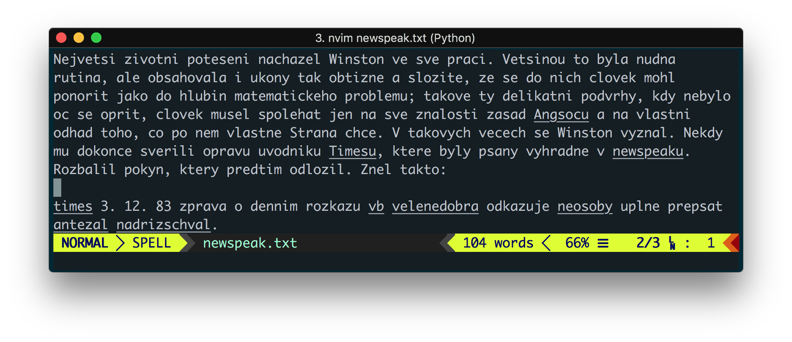

# bez-diakritiky.vim
> český slovník bez diakritiky pro Vim



## Instalace
Instalujte pomocí vašeho oblíbeného plugin manageru.
Např. s [vim-plug](https://github.com/junegunn/vim-plug):
```viml
Plug 'xxdavid/bez-diakritiky.vim'
```

Spellcheck pak zapnete přes:
```viml
set spell
set spelllang=csa
```

**Tip**: můžete kontrolovat i více jazyků zároveň (např. `set spelllang=cs,csa,en`).

## Autorství
Tento slovník vychází ze [slovníku pro Open Office](https://extensions.openoffice.org/en/project/czech-dictionary-pack-ceske-slovniky-cs-cz), který vychází GNU/GPL slovníku Petra Koláře a přispěvatelů (viz LICENSE).

Z toho slovníku jsem pouze odebral diakritiku a pomocí `mkspell` vygeneroval slovník pro Vim.
